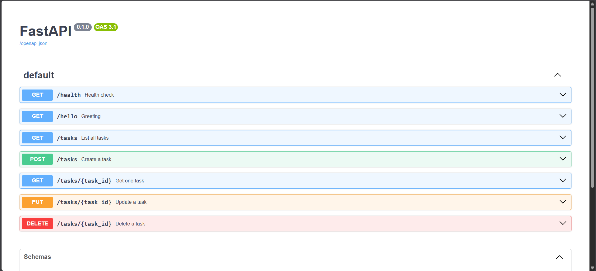

# Task API

A small CRUD API for managing a to-do list, built with FastAPI. Tasks are stored in memory (no database) — restarting the server resets the data to the three seeded examples.

## How to run

1. Clone this repo and move into it:
   ```bash
   git clone <https://github.com/Beyazt43/FlyRank_Backend_HW1>
   cd <repo-folder>
   ```

2. Create and activate a virtual environment:
   ```bash
   python -m venv venv

   # Windows PowerShell
   .\venv\Scripts\Activate.ps1

   # Mac/Linux
   source venv/bin/activate
   ```

3. Install dependencies:
   ```bash
   pip install -r requirements.txt
   ```

4. Start the server:
   ```bash
   uvicorn main:app --reload
   ```

5. Visit `http://localhost:8000/docs` for interactive Swagger UI, or use curl / your browser directly against `http://localhost:8000`.

## Endpoints

| Method | Path | Description | Status codes |
|--------|------|-------------|---------------|
| GET | `/` | API info | 200 |
| GET | `/health` | Health check | 200 |
| GET | `/hello` | Greeting | 200 |
| GET | `/tasks` | List all tasks | 200 |
| GET | `/tasks/{id}` | Get one task | 200, 404 |
| POST | `/tasks` | Create a task | 201, 400 |
| PUT | `/tasks/{id}` | Update a task | 200, 400, 404 |
| DELETE | `/tasks/{id}` | Delete a task | 204, 404 |

## Example request

```
$ curl -i -X POST http://localhost:8000/tasks -H "Content-Type: application/json" -d '{"title":"Do the homework"}'

output:

POST /tasks HTTP/1.1" 201 Created
content-type: application/json

{"id":4,"title":"Do the homework","done":false}
```


## Swagger UI




## Notes on validation behavior

- `POST`/`PUT` with a completely missing `title` field returns FastAPI's built-in `422 Unprocessable Content` (Pydantic's automatic schema validation).
- `POST`/`PUT` with an empty or whitespace-only `title` (e.g. `{"title": ""}`) returns a custom `400 Bad Request` from application-level validation.
- This two-layer behavior is standard for FastAPI and intentional — both cases are handled, just at different layers.

## In-memory storage

Data lives only in a Python list in `main.py`. Restarting the server resets tasks back to the three seed examples. This is by design for this stage of the project — persistence (a real database) comes in a later assignment.
